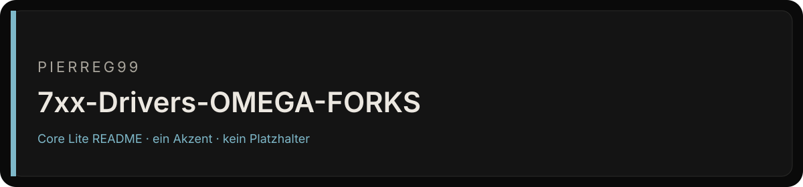

# 7xx-Drivers-OMEGA-FORKS

Windows Driver pack for 7xx Snapdragon platforms.

<table>
<tr>
<td width="58%" valign="top">

### Bestand

Windows Driver pack for 7xx Snapdragon platforms. This OMEGA fork keeps the existing driver documentation available without turning unverified claims into features.

Der Default-Branch `main` ist die Fläche, die zählt. Was nicht in diesem Baum liegt, ist kein Feature dieses Repos.

</td>
<td width="42%" valign="top">

### Fakten

| Feld | Wert |
| --- | --- |
| Owner | Pierreg99 |
| Branch | `main` |
| Sichtbarkeit | public |
| Linie | OMEGA Fork |
| README | Cryo Core Lite v1.5 |

</td>
</tr>
</table>

## Lesen

1. Default-Branch öffnen.
2. Nur Dateien in diesem Baum als Beleg nehmen.
3. Bestehende Treiberhinweise und Credits bleiben in der archivierten README erhalten.

## Bisherige Dokumentation

Die vorherige README bleibt vollständig im aktuellen Repository erhalten:

**[README.before-cryo-core-v1.5.md](./README.before-cryo-core-v1.5.md)**

## Grenze

Keine Qualitätszahl, kein Paketstand und keine Runtime, die nicht als Datei in diesem Repo steht.

Fläche nach Cryo Core Lite v1.5 · Tokens #0A0A0A / #141414 / #7EB8C9

